# rdra-requirement-definition

## Sample Diagram

### Table of Contents

- [10 System Value](src/sample/10_SystemValue)
  - [Context Model](src/sample/10_SystemValue/ContextModel)
  - Requirement Model
- [20 System Outer Environment](src/sample/20_SystemOuterEnvironment)
  - Business Model
  - Conceptual Model
  - Usage Scene Model
- [30 System Border](src/sample/30_SystemBorder)
  - Event Model
  - Protocol Model
  - Screen Model
  - Protocol Model
- [40 System](src/sample/40_System)
  - Data Model
  - Domain Model
  - Feature Model
- [50 Relational Model](src/sample/50_RelationalModel)
  - Business Flow and Use Case
  - Feature Composite Model
  - Useage Scene and Use Case
  - Use Case and Feature
  - Use Case and Screen, Report

### Context Model

### Requirement Model

