# Use Case Model

## Purpose

- aaa

## Background

## Elements

|Item|Discription|Icon in UML|
|:--|:--|:--|
|ー|ー|ー|

## How to Modeling

## Relationship to other Models

## Application

## Self Check
